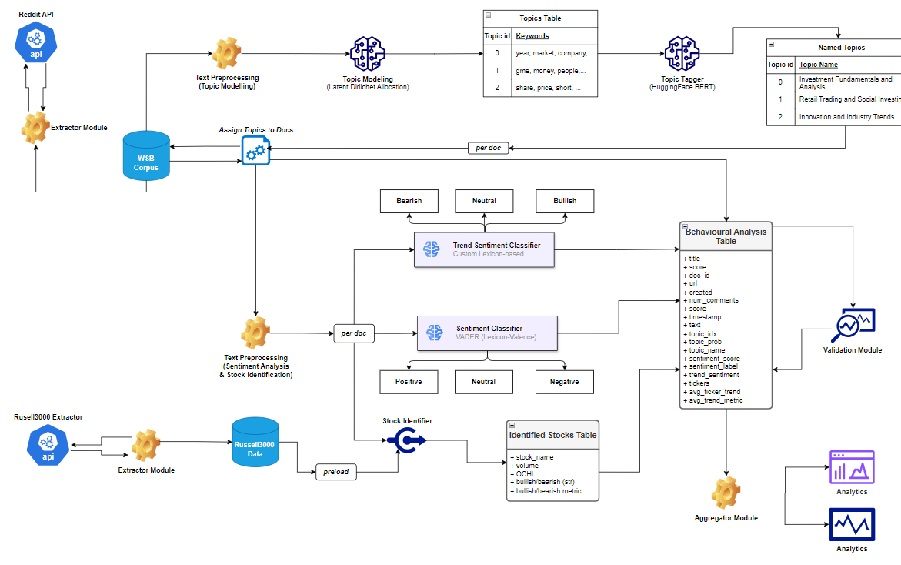

# WallstreetbetsGenNLP

AI-powered behavioral analysis framework of Wallstreetbets investor discussions using topic clustering, sentiment analysis, text mining, 
and data analytics with Python, HuggingFace, Streamlit, and Google Cloud.

## Architecture

## Dashboard 

See `analysis_ui.py`

