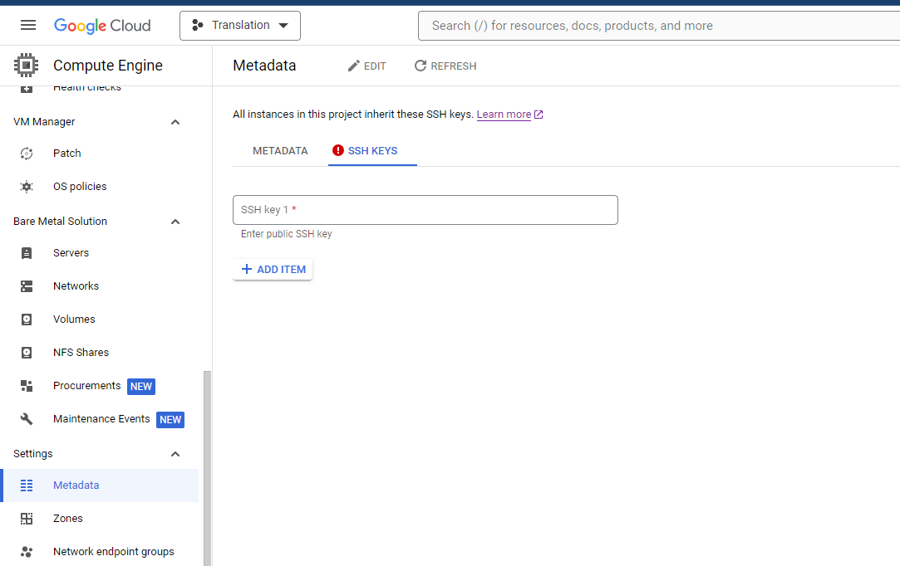
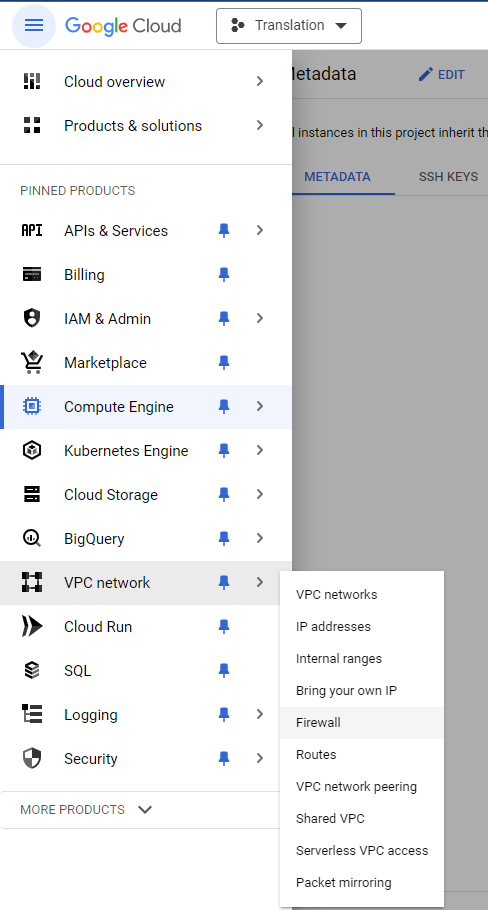

# VM Cloud Setup  Notes

## Installing pip to the VM 

**Correct command for installing pip** 

```
sudo apt-get install python3-pip
```

This should install all pip components, but using **an env is strongly encouraged** (see below). 

**WRONG WAY:** Method below doesn't work!!! 

```
sudo curl "https://bootstrap.pypa.io/get-pip.py" -o "get-pip.py"
sudo python get-pip.py
```

error: 

```
hair_parra@ml-test1-20240322-194131:~$ sudo python3 get-pip.py
error: externally-managed-environment

× This environment is externally managed
╰─> To install Python packages system-wide, try apt install
    python3-xyz, where xyz is the package you are trying to
    install.
    
    If you wish to install a non-Debian-packaged Python package,
    create a virtual environment using python3 -m venv path/to/venv.
    Then use path/to/venv/bin/python and path/to/venv/bin/pip. Make
    sure you have python3-full installed.
    
    If you wish to install a non-Debian packaged Python application,
    it may be easiest to use pipx install xyz, which will manage a
    virtual environment for you. Make sure you have pipx installed.
    
    See /usr/share/doc/python3.11/README.venv for more information.

note: If you believe this is a mistake, please contact your Python installation or OS distribution provider. You can override this, at the risk of breaking your Python installation or OS, by passing --break-system-packages.
```

**Takehome:** non-Debian distribution requires to create an env?

## Installing an Env

Reference: https://askubuntu.com/questions/1465218/pip-error-on-ubuntu-externally-managed-environment-%C3%97-this-environment-is-extern 

- Instead, use: `sudo apt install python3-venv`
- `python3 -m venv env`
- `source test_env/bin/activate` 
- `deactivate` 

Now can install all crap inside. 

## Installing git 

```
sudo apt-get update
sudo apt-get install git 
```


## Genrate SSH-key 

```
ssh-keygen -t rsa -b 2048
```

- go to directory and copy public key `id_rsa.pub` 
- go to Google Cloud compute engine **Metadata** 



## Creating the Firewall rule after the key 

**Reference:** https://www.youtube.com/watch?v=elXJCyBSHUk



**Direct SSH** 

- Ensure SSH access in VPC network is enabled
```
ssh -i path_to_private_key user@PUBLIC_IP
ssh -i "C:PATH_SSH\.ssh\id_rsa" user@34.29.147.119
```

**SSH through gcloud API** 

TODO

